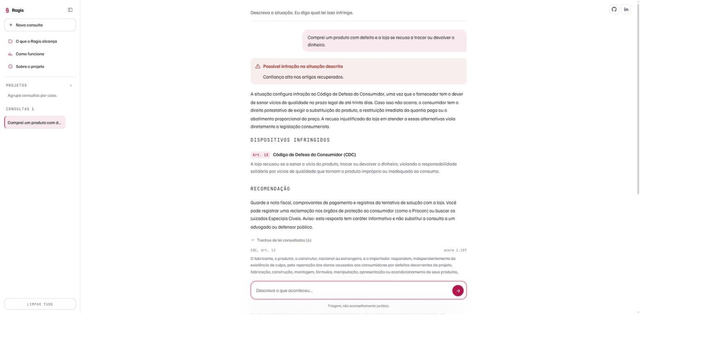
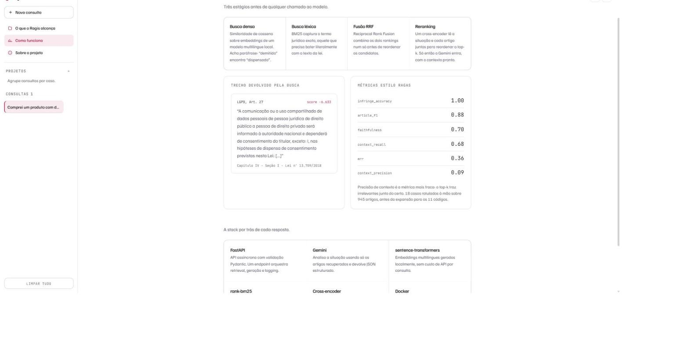
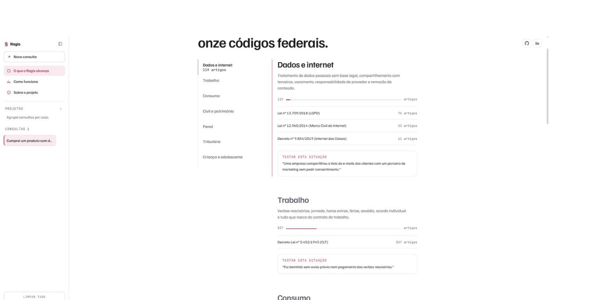

# Ragis — RAG sobre a legislação federal brasileira

Descreva uma situação em português. O sistema recupera os artigos de lei
realmente aplicáveis em **11 códigos federais (6.034 artigos)** e só então
pede a análise ao modelo, preso ao que foi recuperado. A resposta cita lei e
artigo verificáveis, e mostra os trechos consultados.


---

## Por que este projeto existe

Modelos de linguagem erram direito de um jeito específico e perigoso: inventam
número de artigo com naturalidade, não sabem dizer de onde tiraram a resposta e
misturam redação revogada com a lei em vigor.

Isso está medido. Dahl, Magesh, Suzgun e Ho (Stanford RegLab) testaram modelos
com perguntas verificáveis sobre casos federais e encontraram **alucinação
entre 58% (GPT-4) e 88% (Llama 2)**, além de constatarem que os modelos
frequentemente **não sabem quando estão alucinando**.

> Dahl, M., Magesh, V., Suzgun, M., Ho, D. E. (2024). *Large Legal Fictions:
> Profiling Legal Hallucinations in Large Language Models.* Journal of Legal
> Analysis, 16(1), 64–93. [arXiv:2401.01301](https://arxiv.org/abs/2401.01301)

RAG é a resposta usual, e funciona, mas **não é bala de prata** — e o projeto
assume isso explicitamente. A mesma equipe auditou as ferramentas jurídicas
comerciais que se anunciam "hallucination-free" e mediu **17% a 33% de
alucinação** no Lexis+ AI e no Westlaw AI-Assisted Research.

> Magesh, V., Surani, F., Dahl, M., Suzgun, M., Manning, C. D., Ho, D. E.
> (2024). *Hallucination-Free? Assessing the Reliability of Leading AI Legal
> Research Tools.* Journal of Empirical Legal Studies.
> [arXiv:2405.20362](https://arxiv.org/abs/2405.20362)

Por isso a interface **nunca afirma ausência de infração**: ela relata o que a
busca encontrou, e quando não encontra, diz que não encontrou — o que é
diferente de dizer que a situação é legal.



---

## Decisões de arquitetura, e a pesquisa por trás de cada uma

O pipeline tem quatro estágios antes de qualquer geração. Cada um resolve uma
falha conhecida do estágio anterior.



### 1. Busca densa — `paraphrase-multilingual-mpnet-base-v2`

Quem descreve um problema não usa o vocabulário da lei: "fui mandado embora"
precisa encontrar "dispensa sem justa causa". Embeddings de sentença resolvem
paráfrase, rodam localmente e não custam por consulta.

> Reimers, N., Gurevych, I. (2019). *Sentence-BERT: Sentence Embeddings using
> Siamese BERT-Networks.* EMNLP. [arXiv:1908.10084](https://arxiv.org/abs/1908.10084)

### 2. Busca léxica — `rank-bm25`

Busca densa erra o termo exato. "Usucapião", "aviso prévio" e números de artigo
precisam bater literalmente. BM25 continua sendo o baseline difícil de superar
em recuperação léxica.

> Robertson, S., Zaragoza, H. (2009). *The Probabilistic Relevance Framework:
> BM25 and Beyond.* Foundations and Trends in Information Retrieval, 3(4).

### 3. Fusão — Reciprocal Rank Fusion

Os dois métodos acertam coisas diferentes, e seus scores estão em escalas que
não se comparam. O RRF funde pela **posição** no ranking, o que dispensa
calibrar pesos e, no paper original, supera Condorcet e métodos de learning to
rank treinados.

> Cormack, G. V., Clarke, C. L. A., Buettcher, S. (2009). *Reciprocal Rank
> Fusion outperforms Condorcet and individual Rank Learning Methods.* SIGIR.

### 4. Reranking — `unicamp-dl/mMiniLM-L6-v2-mmarco-v2`

Bi-encoders codificam pergunta e documento separadamente, o que é rápido mas
perde a interação entre os dois. Um cross-encoder lê os dois **juntos** e
decide se aquele artigo responde àquela situação. É o maior ganho de precisão
do pipeline e o estágio mais caro, por isso roda só sobre os candidatos.

> Nogueira, R., Cho, K. (2019). *Passage Re-ranking with BERT.*
> [arXiv:1901.04085](https://arxiv.org/abs/1901.04085)
>
> Bonifacio, L. et al. (2021). *mMARCO: A Multilingual Version of the MS MARCO
> Passage Ranking Dataset.* [arXiv:2108.13897](https://arxiv.org/abs/2108.13897)
> — o modelo de rerank usado aqui é treinado nesse corpus, em português.

### 5. Geração — Gemini com schema de resposta

A saída é JSON validado por schema, não texto livre: veredito, artigos citados
e confiança chegam como campos. Isso permite à interface tratar cada caso, e
principalmente **recusar uma conclusão** quando o modelo não tem base.

O `top_k` é mantido enxuto (6) de propósito: contexto longo degrada a
utilização da informação no meio da janela.

> Liu, N. F. et al. (2023). *Lost in the Middle: How Language Models Use Long
> Contexts.* TACL. [arXiv:2307.03172](https://arxiv.org/abs/2307.03172)

### O conceito geral

> Lewis, P. et al. (2020). *Retrieval-Augmented Generation for
> Knowledge-Intensive NLP Tasks.* NeurIPS.
> [arXiv:2005.11401](https://arxiv.org/abs/2005.11401)

---

## Cobertura



## Fontes legais incluídas (6.034 artigos)

| Lei | Artigos | Área |
|---|---|---|
| Lei nº 13.709/2018 (LGPD) | 75 | Proteção de dados pessoais |
| Lei nº 12.965/2014 (Marco Civil) | 33 | Direito digital |
| Decreto nº 9.854/2019 | 11 | Internet das Coisas (política pública) |
| Decreto-Lei nº 5.452/1943 (CLT) | 837 | Trabalhista |
| Lei nº 8.078/1990 (CDC) | 122 | Consumidor |
| Lei nº 5.172/1966 (CTN) | 231 | Tributário |
| Lei nº 8.069/1990 (ECA) | 326 | Criança e adolescente |
| Decreto-Lei nº 2.848/1940 (Código Penal) | 402 | Penal |
| Decreto-Lei nº 3.689/1941 (CPP) | 846 | Processual penal |
| Lei nº 13.105/2015 (CPC) | 1.071 | Processual civil |
| Lei nº 10.406/2002 (Código Civil) | 2.080 | Civil (família, contratos, obrigações, propriedade, sucessões) |

**Fora do escopo, por serem inviáveis de forma genérica:** legislação
estadual e municipal (26 estados + DF + mais de 5.500 municípios, cada um com
seu próprio código — só faz sentido indexar um estado/cidade específico à
parte).

Textos extraídos diretamente do Planalto (fonte oficial) e divididos por
artigo em `data/processed/articles.jsonl`. O parser (`app/parse_laws.py`)
lida com várias particularidades de scraping descobertas ao longo da
indexação: redações históricas revogadas em *strikethrough* markdown (CLT),
"Art." e o número do artigo renderizados em linhas separadas (CTN e outros),
o indicador ordinal "º" convertido para a letra "o" e capturado incorretamente
como sufixo do artigo, números de milhar com ponto separador ("Art. 1.641"
no Código Civil), pontos escapados em markdown depois de dígitos ("75\."),
links de jurisprudência colados ao marcador do artigo, e artigos vetados
("(VETADO)") sem texto útil.

## Arquitetura do pipeline

1. **`app/parse_laws.py`** — converte os textos brutos (`data/raw/*.md`) em
   artigos estruturados, um JSON por artigo.
2. **`app/ingest.py`** — gera embeddings (modelo multilingue local,
   `paraphrase-multilingual-mpnet-base-v2` via `sentence-transformers`) para
   cada artigo e salva o índice em `data/index/`.
3. **`app/retrieve.py`** — retrieval híbrido em 3 estágios (padrão usado em
   RAG de produção):
   - busca densa (embeddings, top 30) + busca lexical (BM25, top 30);
   - fusão por **Reciprocal Rank Fusion** (RRF) dos dois rankings (top 15);
   - **reranking** com cross-encoder multilingue
     (`unicamp-dl/mMiniLM-L6-v2-mmarco-v2`, treinado em português) para
     escolher os 6 artigos finais.
4. **`app/llm.py`** — envia a situação + artigos recuperados para o Gemini,
   que responde em JSON estruturado (se há infração, qual lei/artigo,
   motivo, recomendação). Retry automático em erros 503 (alta demanda);
   erros de chave inválida, limite de requisições, resposta bloqueada por
   filtro de segurança ou JSON malformado são tratados sem quebrar a
   requisição.
5. **`app/logging_config.py`** — logging estruturado (JSON-lines) de cada
   consulta: situação, artigos recuperados + scores, modelo, latência, uso
   de tokens e veredito. Grava em `logs/app.jsonl` (rotativo) e stdout —
   pré-requisito para plugar uma plataforma de observability (Langfuse,
   LangSmith) depois sem reinstrumentar o código.
6. **`app/server.py`** — API FastAPI (`POST /api/query`) + serve a interface
   web em `static/index.html`.

## Setup

```bash
pip install -r requirements.txt

# Gera os artigos estruturados a partir dos textos brutos (já executado)
python app/parse_laws.py

# Gera o índice vetorial (baixa modelos de embeddings/reranking na 1ª vez)
python app/ingest.py

# Copie .env.example para .env e preencha sua chave do Gemini
cp .env.example .env
# edite .env e defina GEMINI_KEY=...

# Suba o servidor
uvicorn app.server:app --reload --port 8000
```

Depois abra http://localhost:8000

### Docker

```bash
docker build -t rag-lgpd .
docker run -p 8000:8000 -e GEMINI_KEY=sk-... rag-lgpd
```

O build já roda `parse_laws.py` + `ingest.py` e baixa os modelos de
embeddings/reranking, então o container sobe pronto, sem depender de
internet em runtime (só para chamar a API do Gemini).

## Avaliação (`eval/`)

`eval/golden_set.jsonl` tem 18 situações rotuladas manualmente (LGPD, Marco
Civil, CLT e casos sem infração) com a lei/artigo esperado. `eval/run_eval.py`
roda o pipeline completo contra esse golden set e calcula métricas no estilo
RAGAS, que separa a qualidade do **retrieval** da qualidade da **geração**:

> Es, S., James, J., Espinosa-Anke, L., Schockaert, S. (2023). *RAGAS:
> Automated Evaluation of Retrieval Augmented Generation.*
> [arXiv:2309.15217](https://arxiv.org/abs/2309.15217)


- **context_precision / context_recall / mrr** — qualidade do retrieval,
  calculadas diretamente contra os rótulos (sem LLM).
- **faithfulness** — a resposta do modelo está fundamentada nos artigos
  recuperados, ou está inventando? Nota 0–1 dada por um LLM-juiz.
- **article_f1 / infringe_accuracy** — o pipeline apontou a lei/artigo
  certo e acertou o veredito sim/não.

```bash
python eval/run_eval.py
```

> Reimplementa as métricas do RAGAS nativamente em vez de depender do pacote
> `ragas`, porque ele traz `scikit-network` como dependência obrigatória, que
> não tem wheel pré-compilada para Python 3.14 no Windows e exige o MSVC
> Build Tools para compilar do zero. As métricas e a metodologia são as
> mesmas.

**Resultado mais recente** (18/18 itens, modelo `gemini-3.5-flash-lite`,
corpus de 945 artigos — LGPD/Marco Civil/CLT, antes da expansão para os 11
códigos atuais):

| Métrica | Valor |
|---|---|
| context_recall | 0.68 |
| mrr | 0.36 |
| article_f1 | 0.88 |
| infringe_accuracy | 1.00 |
| faithfulness | 0.70 |

> `golden_set.jsonl` ainda cobre só LGPD/Marco Civil/CLT — não foi reexecutado
> contra os 6.034 artigos atuais (CDC, Código Civil, Código Penal, CTN, ECA,
> CPP, CPC). Expandir o golden set para essas áreas é o próximo passo natural
> antes de confiar nas métricas em produção.

Achado já documentado no corpus menor: o recall de retrieval cai para alguns
artigos específicos (ex. CLT Art. 477 sobre prazo de pagamento de verbas
rescisórias nem sempre entra no top-6) — quando isso acontece, o modelo
prefere responder "sem infração" a citar um artigo sem contexto que o
sustente, o que é seguro mas mascara a lacuna de recall.

Com a expansão para 6.034 artigos em 11 códigos, esse efeito fica mais forte:
testes manuais (não formais) mostram acertos fortes em áreas com vocabulário
bem específico (ECA, Código Civil) e misses em consultas que dependem de um
princípio jurídico mais abstrato do que de uma palavra-chave direta (ex.
"bitributação" no CTN, "duração razoável do processo" no CPC) — o
candidato certo às vezes nem entra no pool antes do rerank. Aumentamos os
pools de busca dispersa/lexical de 30→60 candidatos como mitigação parcial,
mas isso é uma limitação real da arquitetura de corpus único e amplo, não
resolvida por completo.

## API

`POST /api/query`
```json
{ "situacao": "descrição da situação..." }
```
Resposta:
```json
{
  "infringe": true,
  "confianca": "alta",
  "violacoes": [{"lei": "LGPD", "artigo": "Art. 7º", "motivo": "..."}],
  "analise": "...",
  "recomendacao": "...",
  "artigos_relevantes": [...]
}
```

Quando a situação está vazia, não tem relação com nenhuma lei indexada, ou a
chamada ao Gemini falha por qualquer motivo (chave inválida, limite de taxa,
indisponibilidade, resposta bloqueada por filtro de segurança, JSON
inválido), a API responde `200` normalmente com `infringe: null` e uma
mensagem explicativa em `analise` — nunca um erro cru sem contexto.

## Limitações

- Esta ferramenta é um auxiliar de triagem baseado em busca semântica + LLM,
  não um parecer jurídico. Sempre revise com um advogado.
- O modelo padrão (`gemini-3.5-flash-lite`) foi escolhido porque
  `gemini-3.6-flash` tem cota gratuita de apenas 20 requisições/dia — troque
  via `GEMINI_MODEL` no `.env` se tiver uma conta paga e quiser mais
  qualidade.
- O índice cobre as quatro normas acima; para outras leis (Código de Defesa
  do Consumidor, Código Penal, etc.) é preciso adicionar os textos em
  `data/raw/` e reexecutar `parse_laws.py` + `ingest.py`.
- Ver a seção "Avaliação" acima para as métricas de qualidade e lacunas
  conhecidas do retrieval.
